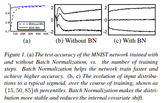
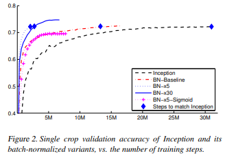
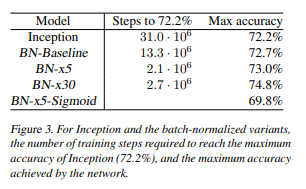
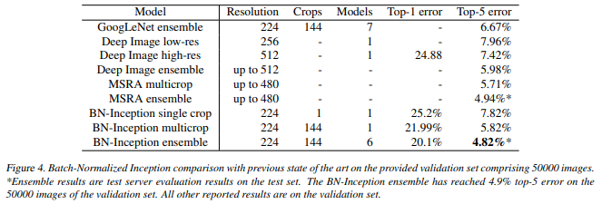

# Understanding Batch Normalization

> **Paper:** Ioffe, S., & Szegedy, C. (2015). *Batch Normalization: Accelerating Deep Network Training by Reducing Internal Covariate Shift*. ICML. [Read on arXiv](https://arxiv.org/abs/1502.03167)

## Problem
The change in the distribution of activations from each layer of a neural network is detrimental to its training. It causes a need for lower learning rates and careful parameter initialization. This is known as *internal covariate shift*, and is common in deep neural networks.

## Solution
To solve internal covariate shift, activations are normalized before entering the next layer. To prevent changing the representability of a layer, the normalized values are scaled and shifted using learned parameters. This transformation is applied to each mini-batch during training. 

## Method 
For a given mini-batch, the following transformation is applied to each input feature during training-

Calculation of mean:

$$ \mu_{\mathcal{B}} \leftarrow \frac{1}{m} \sum_{i=1}^m x_i $$

Calculation of variance:

$$ \sigma_{\mathcal{B}}^2 \leftarrow \frac{1}{m} \sum_{i=1}^m (x_i - \mu_{\mathcal{B}})^2 $$

Normalization:

$$ \hat{x}_i \leftarrow \frac{x_i - \mu_{\mathcal{B}}}{\sqrt{\sigma_{\mathcal{B}}^2 + \epsilon}} $$

where $\epsilon$ is a small constant added for numerical stability

Scaling and shifting:

$$ y_i \leftarrow \gamma \hat{x}_i + \beta $$

During inference, the network uses the moving average of the mean and variance (collected during training) rather than the batch statistics. This ensures a deterministic output for a given input.

The gradients for the backward pass are-

Gradient for scale parameter:

$$ \frac{\partial \mathcal{L}}{\partial \gamma} = \sum_{i=1}^m \frac{\partial \mathcal{L}}{\partial y_i} \cdot \hat{x}_i $$

Gradient for shift parameter:

$$ \frac{\partial \mathcal{L}}{\partial \beta} = \sum_{i=1}^m \frac{\partial \mathcal{L}}{\partial y_i} $$

Gradient for input:

$$ \frac{\partial \mathcal{L}}{\partial x_i} = \frac{1}{m \sqrt{\sigma_{\mathcal{B}}^2 + \epsilon}} \left( m \frac{\partial \mathcal{L}}{\partial \hat{x}_i} - \sum_{j=1}^m \frac{\partial \mathcal{L}}{\partial \hat{x}_j} - \hat{x}_i \sum_{j=1}^m \frac{\partial \mathcal{L}}{\partial \hat{x}_j} \hat{x}_j \right) $$

where 
$$ \frac{\partial \mathcal{L}}{\partial \hat{x}_i} = \frac{\partial \mathcal{L}}{\partial y_i} \cdot \gamma $$

## Implementation
* A simple neural network to predict the digits of the MNIST dataset. The input was a 28x28 image, and it had 3 fully-connected hidden layers with 100 activations each. The output layer is a fully-connected layer with 10 activations (one per class) and cross-entropy loss. The network was trained for 50000 steps, with 60 examples per mini-batch. Batch normalization was added to each hidden layer.
* Batch normalization was applied to a new variant of the Inception network, trained on the ImageNet classification task. The network has a large number of convolutional and pooling layers, with a softmax layer to predict the image class, out of 1000 possibilities. The network contains $13.6·10^6$ parameters, and, other than the top softmax layer, has no fully-connected layers. After applying batch normalization to each layer of the inception network, the following modifications were also applied:
    * Increased learning rate - learning rates can be increased with no negative side effects, speeding up training
    * Removal of dropout layers - dropout can be removed while retaining accuracy, as batch normalization acts as a regularizer
    * Thorough shuffling of training samples - this ensures mini-batches do not contain the same groups of samples
    * Reduced $L_2$ weight regularization - helps improve accuracy
    * Accelerated learning rate decay - since the training is faster, the decay acceleration is also increased
    * Removed local response normalization - not necessary with batch normalization
    * Reduced photometric distortions - since training is faster and there are fewer training sample observations, more real data is used
* Various single and ensemble networks were trained on the LSVRC2012 training data and tested on the validation data

## Results

  
  
<i>MNIST network training</i>

As shown above, batch normalization helps reduce the number of steps to reach high generalisation accuracy

  
  
<i>Inception network training</i>

  
  
<i>Inception network results</i>

As seen above, batch normalization speeds up convergence as well as improves accuracy in certain scenarios

  
  
<i>Comparison with previous state-of-the-art results</i>

## Strengths
Batch normalization significantly improves training speeds in neural networks. It also allows other modifications that help speed up training. 

## Weaknesses
The new parameters introduced increase the complexity of the network, and require calculation of more gradients.

## My Thoughts
Batch normalization is now ubiquitous in deep learning pipelines, so it is remarkable to see how it came about. In practice it seems pretty simple, but the theory and foundation behind it is rather complex. 
