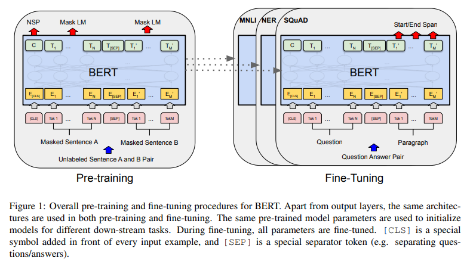
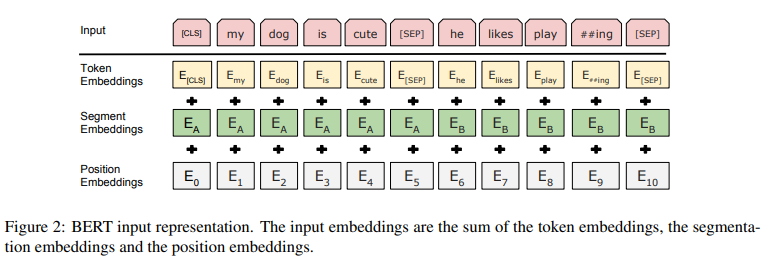
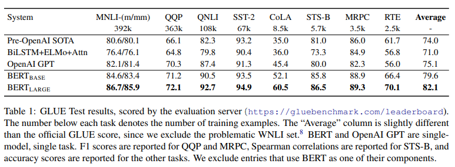
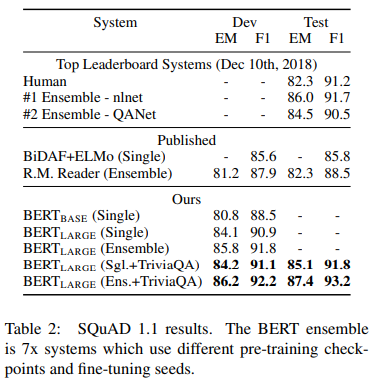
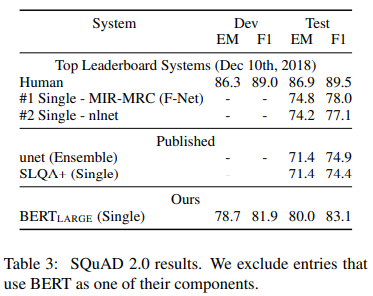
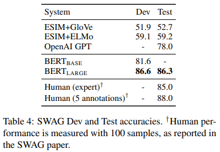
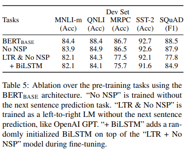
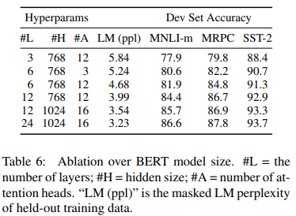
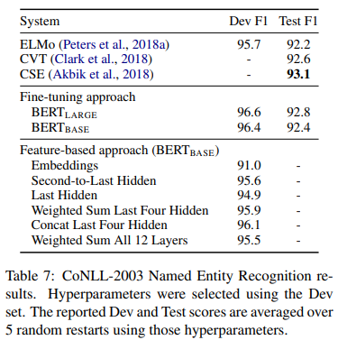

# Discussing Google's BERT model

> **Paper:** Devlin, J., Chang, M. W., Lee, K., & Toutanova, K. (2018). *BERT: Pre-training of Deep Bidirectional Transformers for Language Understanding*. arXiv. [Read on arXiv](https://arxiv.org/abs/1810.04805)

## About
BERT (Bidirectional Encoder Representations from Transformers) is a bidirectional pre-trained encoder-only transformer model created by researchers at Google. It is trained to understand the relationships between words and sentences, and can easily be further trained by adding a single output layer to perform a variety of natural language processing tasks. It uses a *fine-tuning* approach to perform downstream tasks, similar to OpenAI's GPT models, as opposed to a *feature-based* approach, as used in other contemporary models such as ELMo. It uses bidirectional context (both left-to-right as well as right-to-left) during training and inference.

## Architecture
The model is pre-trained on unlabeled data over different tasks. For any downstream task, the model is initialized with the pre-trained model's weights, and then the weights are fine-tuned using labeled data. 

  
  
<i>Visualization of pre-training and fine-tuning tasks</i>

BERT is a multi-layer bidirectional transformer. The number of layers is denoted as *L*, the hidden size as *H*, and the number of self-attention heads as *A*. Two models are primarily reported on, $\textbf{BERT_\text{BASE}}$ (12 layers, 768 hidden size, 12 attention heads per layer, 110M parameters) and $\textbf{BERT_\text{LARGE}}$ (24 layers, 1024 hidden size, 16 attention heads per layer, 340M parameters).

$BERT_\text{BASE}$ has a similar model size to OpenAI's GPT model. The key difference between the models is that the BERT transformer uses bidirectional self-attention, while the GPT transformer uses constrained self-attention. 

## Text Representation
A single sentence or a pair of sentences can be represented as a single sequence. WordPiece embeddings (30,000 vocabulary size) are used to tokenize the text.

The first token of a sequence is always the special classification token ([CLS]). The final hidden state corresponding to this token is used to store the entire sentence's meaning for classification tasks. 

To separate sentences, a special separator token ([SEP]) is added between the sentences, and a learned embedding is added to each token to indicate which sentence it comes from.

Learned position embeddings are added, unlike the sinusoidal position embeddings used in the original transformer model.

Input embeddings are denoted as *E*, the final hidden vector corresponding to [CLS] as $C \in \mathbb{R}^H$, and the final hidden vector corresponding to the $i^\text{th}$ token as $T_i \in \mathbb{R}^H$. Hence, a token's representation is the sum of token, segment, and position embeddings. 

  
  
<i>Input embeddings</i>

## Pre-training
2 unsupervised tasks are used to train BERT: Masked Language Modelling (MLM) and Next Sentence Prediction (NSP). The BooksCorpus (800M words) and English Wikipedia (2500M words) datasets are used. For Wikipedia, only text passages are used and lists, tables, and headers are ignored.
### Masked Language Modeling (MLM)
Also commonly known as a *Cloze* task, MLM involves masking a percentage of the input tokens and then predicting them. The final hidden vectors corresponding to the masked tokens are fed into a softmax layer over the vocabulary to predict the masked token, as in a standard LM. 

In every experiment, 15% of the tokens are masked at random. Out of the masked tokens that are chosen:
* 80% of them are replaced with the [MASK] token
* 10% of them are replaced with a random word
* 10% are kept as is

$T_i$ is used to predict the original token, with cross entropy loss used to backpropagate the gradients.

### Next Sentence Prediction (NSP)
Important downstream tasks require an understanding of the relationship between sentences, which language modeling cannot directly capture. Hence, a binarized next sentence prediction task is used to train the model.

For each example, 2 sentences `A` and `B` are chosen. 50% of the time, `B` is the sentence after `A` (labeled `IsNext`), and 50% of the time, `B` is a random sentence from the corpus (labeled `NotNext`). *C* is used as the predictor.

## Fine-tuning
The self-attention mechanism in the transformer allows BERT to perform various downstream tasks with ease. For any task, the inputs and outputs are fed into BERT, and all the parameters are fine-tuned end-to-end. The sentence `A` and `B` pairing from pre-training are analogous to:
* sentence pairs in paraphrasing
* hypothesis-premise pairs in entailment
* question-passage pairs in question answering
* a degenerate text-$\emptyset$ pair in text classification/sequence tagging

For token-level tasks the output token hidden vectors are fed into an output layer. For classification tasks the [CLS] token is fed into an output layer.

## Experiments
The BERT model is used to perform various NLP tasks and benchmarks.
### GLUE (General Language Understanding Evaluation)
To fine-tune on the various GLUE tests, *C* is used as the final aggregate representation. The new parameters introduced are:
* $W \in \mathbb{R}^{K \times H}$ 
where *K* is the number of labels

A standard classification loss is computed with *C* and *W*: log(softmax($CW^T$))

Batch size: 32 \
Epochs: 3 \
Learning rate: best among [5e-5, 4e-5, 3e-5, and 2e-5]

For $BERT_\text{LARGE}$, fine-tuning was sometimes unstable; hence random restarts were run and the best performing model on the dev set was selected.

  
  
<i>GLUE results</i>

### SQuAD (Stanford Question Answering Dataset) v1.1
In this task, a question and a Wikipedia passage containing the answer are provided, and the answer text span in the passage is to be predicted.

The question and passage are represented as a single sequence, with the question using the `A` embedding and the passage using the `B` embedding. A start vector $S \in \mathbb{R}^H$ and an end vector $E \in \mathbb{R}^H$ are introduced during training. The probability of the $i^{\text{th}}$ word being the start of the answer is computed as

$$P_i = \frac{e^{S \cdot T_i}}{\sum_{j} e^{S \cdot T_j}}$$

The analogous formula is used for the end of the answer. 

The score of a potential span from position *i* to *j* is calculated as $S \cdot T_i + E \cdot T_j$, where *j* $\geq$ *i*. The span with the maximum score is used as the prediction. The objective is the sum of the log-likelihoods of the correct start and end positions.

Batch size: 32 \
Epochs: 3 \
Learning rate: 5e-5

Modest data augmentation is used by first fine-tuning on the TriviaQA dataset. Even without the TriviaQA fine-tuning, the BERT model outperformed the then state of the art.

  
  
<i>SQuAD v1.1 results</i>

### SQuAD (Stanford Question Answering Dataset) v2.0
This extends the SQuAD v1.1 task by allowing the possibility that no short answer exists in the paragraph.

Questions without an answer are treated as having start and end at the [CLS] token. The score of the no-answer span is given by:

$$s_{\text{null}} = S \cdot C + E \cdot C$$

The score of the best non-null span is given by:

$$s_{\hat{i},j} = \max_{j \ge i} (S \cdot T_i + E \cdot T_j)$$

A non-null answer is predicted when $s_{\hat{i},j} \gt s_\text{null} + \tau$, where the threshold $\tau$ is selected on the dev set to maximize F1 score.

Batch size: 48 \
Epochs: 2 \
Learning rate: 5e-5

TriviaQA was not used to fine-tune.

  
  
<i>SQuAD v2.0 results</i>

### SWAG (Situations With Adversarial Generations)
This SWAG dataset contains 113k sentence-pair examples. Given a sentence, the task is to choose the most plausible continuation among 4 choices.

Four input sequences are constructed, each a concatenation of the given sentence (`A`) and a possible continuation (`B`). A vector is introduced as a parameter, whose dot product with *C* denotes a score for a given choice, which is normalized with a softmax layer.

Batch size: 16 \
Epochs: 3 \
Learning rate: 2e-5

  
  
<i>SWAG results</i>

## Ablation Studies
These are experiments where a part of the model is removed, and then trained and compared to the original model. It is a common practice in model design, and helps to decide whether a particular component is necessary or not.

The following variants are tested:
* **No NSP**: BERT model trained on MLM and not NSP
* **LTR & NO NSP**: BERT model trained using standard left-to-right language modeling, and no NSP

  
  
<i>Ablation results</i>

Various model sizes are also tested. Larger models were found to be strictly better than smaller ones.

  
  
<i>Different sizes' performance</i>

A feature-based approach is tested by applying BERT to the CoNLL-2003 Named Entity Recognition (NER) task. A case-preserving WordPiece model is used to create the input. The representation of the first sub-token is used as the input to the token-level classifier over the NER label set. The parameters of the BERT model NOT fine-tuned. Instead, the activations from one or more layers are used as input to a randomly initialized two-layer 768-dimensional BiLSTM, before the classification layer. The models perform comparably to the then state of the art.

  
  
<i>CoNLL-2003 NER results</i>

## My Thoughts
The bidirectional nature of the BERT model proved to be quite effective at the time, outperforming contemporary state of the art models. While current decoder-only models are remarkably powerful and can perform a host of tasks, the BERT model is still helpful in understanding transformer functioning, and is still being used a base for new NLP models such as Meta's RoBERTa, Microsoft's DeBERTa. The encoder-only architecture is still quite good at "understanding" language, and is used in modern technologies such as RAG pipelines.
