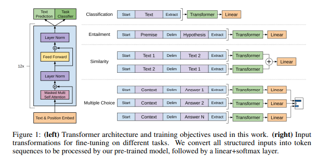
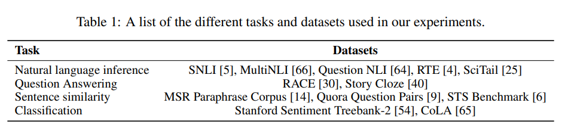
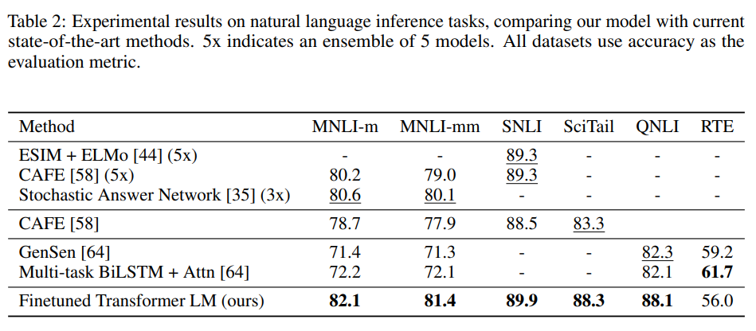
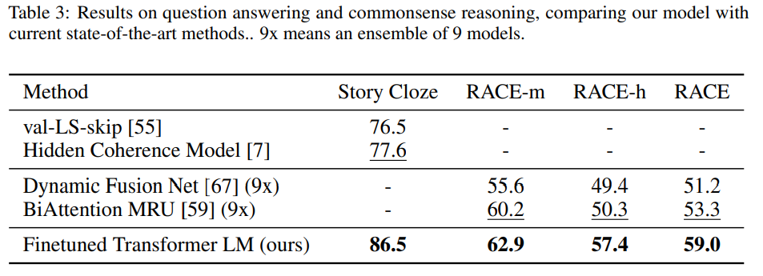
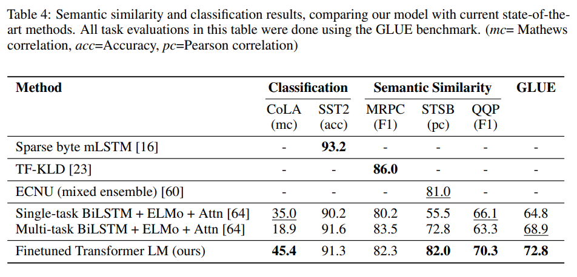
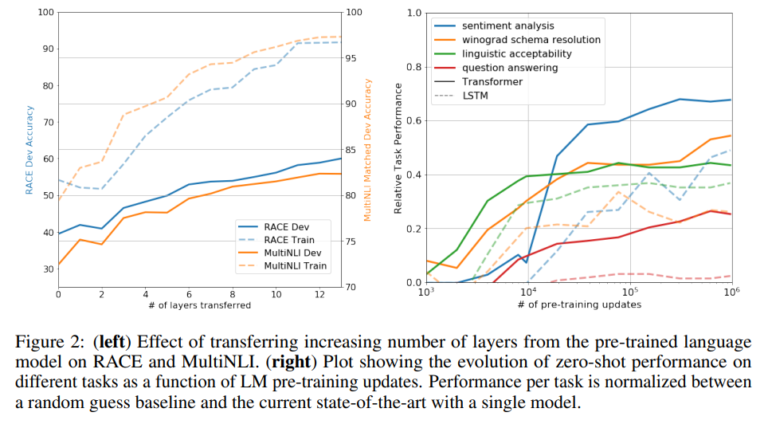
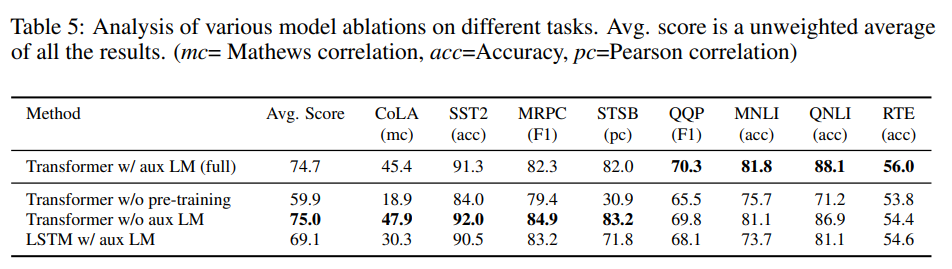

# Discussing OpenAI's GPT model

> **Paper:** Radford, A., Narasimhan, K., Salimans, T., & Sutskever, I. (2018). *Improving Language Understanding by Generative Pre-Training*. OpenAI. [Read on OpenAI Blog](https://openai.com/index/language-unsupervised/)

## About
The team at OpenAI explores using a semi-supervised training method, leveraging unsupervised training and supervised fine-tuning, to learn a universal representation that transfers to various tasks with ease. They train a *transformer* model on unlabeled data, and then fine-tune it on labeled data to perform benchmarks and tests. It is one of the earliest renditions of the generative pre-trained (GPT) model that we all know and use today.

## Architecture
The model is pre-trained on unlabeled data from the BooksCorpus dataset. For downstream tasks the model's weights are adapted to solve the task.

  
  
<i>Architecture and fine-tuning transformations</i>

The model largely follows the original *transformer* architecture. They train a multi-layer decoder-only transformer. The model has 12 layers, 12 heads per layer, and 768 dimensional states per embedding. For the feedforward network 3072 dimensional inner states were used.

## Pre-training
The model is pre-trained using unsupervised methods and then later fine-tuned using supervised methods. For pre-training they used the following configurations:

* Optimizer: Adam 
* Max Learning Rate: 2.5e-4
* Scheduler: Cosine Annealing (linear increased from zero over first 2000 updates, then cosine annealed to zero over remaining updates) 
* Batch Size: 64 
* Epochs: 100 
* Sequence Length: 512 tokens 
* Weight Initialization: $\mathcal{N}(0, 0.02)$ 
* Dropout: 0.1 
* L2 Regularization: 0.1 
* Activation: GELU

A bytepair encoding (BPE) vocabulary was used for tokenization. The positional embeddings were learned, similar to the BERT model, unlike the original transformer that used sinusoidal positional embeddings. The *ftfy* library was used to clean up the text in BooksCorpus, and the *spaCy* library for tokenization. 

An unsupervised corpus of tokens $\mathcal{U} = $ {$u_1, \dots, u_n$} is provided, and a standard language modeling objective is used to maximize:

$$L_1(\mathcal{U}) = \sum_{i} log P(u_i | u_{i-k}, \dots, u_{i-1};\Theta)$$

where $k$ - context length \
      $P$ - probability distribution over the vocabulary \
      $\Theta$ - model parameters

Multi-headed self-attention over input tokens followed by position-wise feedforward layers produces an output distribution:

$$h_0 = UW_e + W_p$$

$$h_l = \mathtt{transformer\_block}(h_{l-1}) \forall l \in [1, n]$$

$$P(u) = \mathtt{softmax}(h_nW_e^T)$$

where $U = u_{-k}, \dots, u_{-1}$ is the context vector of tokens, $n$ is the number of layers, $W_e$ is the token embedding matrix, and $W_p$ is the position embedding matrix.

## Fine-tuning
For fine-tuning, the parameters are updated for the supervised task. A labeled dataset $\mathcal{C}$, consisting of sequences of input tokens $x^1, \dots, x^m$ and each sequence corresponding to a label $y$. The inputs are passed through the model to obtain final activation $h_l^m$, which is passed to a linear layer with parameters $W_y$ to predict y:

$$P(y | x^1, \dots, x^m) = \mathtt{softmax}(h_l^mW_y)$$

The following objective is maximized:

$$L_2(\mathcal{C}) = \sum_{(x,y)}log P(y | x^1, \dots, x^m)$$

Including language modeling as an auxiliary objective helped improve generalization and accelerated convergence. The specific objective is:

$$L_3(\mathcal{C}) = L_2(\mathcal{C}) + \lambda \ast L_1(\mathcal{C})$$

### Input Representation
All inputs include randomly initialized start and end tokens($\langle s \rangle$, $\langle e \rangle$). Certain tasks require specific structured inputs.

#### Textual Entailment
The premise $p$ and hypothesis $h$ are concatenated with a delimiter token ($) in between.

#### Similarity
The two sentences are concatenated with a delimiter. This is done twice, with the sentences swapping order. The outputs from each $h_l^m$ are added element-wise, and then passed to the linear layer.

#### Question Answering and Commonsense Reasoning
The context document $z$ and question $q$ are concatenated, and then that is concatenated with all the $k$ answers $a_k$ with a delimiter in between. This results in the sequence $[z; q; \text{\$}; a_k]$. Each of the sequences corresponding to each answer is passed through the transformer as well as linear layer, and the final outputs are normalized via a softmax layer to produce an output distribution over the label vocabulary.

## Supervised Tasks
Fine-tuning was performed on a variety of tasks.

  
  
<i>Tasks and datasets</i>

### Natural Language Inference
Natural language inference (NLI) involves reading a pair of sentences and describing the relationship between them as either `entailment`, `contradiction`, or `neutral`. They evaluated the performance of the model on 5 datasets: SNLI, MNLI, QNLI, SciTail, RTE. The model performed better than the previous best on each of the datasets, except the RTE dataset.

  
  
<i>NLI performance</i>

### Question Answering and Commonsense Reasoning
This task involves reasoning and handling long-range contexts. They evaluated the performance of the model on the Story Cloze and RACE datasets. They out-performed the previous best here as well.

  
  
<i>QA performance</i>

### Semantic Similarity
This task involves determining whether two sentences are semantically equivalent or not. They used 3 datasets for this task: MRPC, QQP, STS-B. They achieved state of the art perfomance on these tasks as well.

  
  
<i>Semantic similarity performance</i>

### Classification
They test on two classification tasks: CoLA and SST-2. CoLA contains sentences that are either grammatical or not, and SST-2 contains sentences that are either positive or negative. Their model obtained a score of 45.4 on CoLA, and achieved 91.3% accuracy on SST-2. They also achieve an overall score of 72.8 on the GLUE benchmark.

## Analyses
### Layer Transfer Impact
They test out transferring a variable number of layers from the unsupervised pre-training to the supervised tasks. 

  
  
<i>Impact of variable number of layers transferred</i>

### Zero-shot Performance
They hypothesize that the generative model learns tasks to improve its language modeling capability, and that the attentional memory of the transfer assists more in transfer than LSTMs. They designed a bunch of heuristic solutions to test these hypotheses.

### Ablation Studies
They perform 3 ablation studies:

* Removing the auxiliary language modeling objective 
* Comparing with a single layer 2048 unit LSTM using the same framework  
* Directly training on supervised tasks 

  
  
<i>Ablation studies</i>

## My Thoughts
The OpenAI GPT model is the cornerstone of modern NLP and generative AI capability. I find the standard autoregressive objective paired with the attention capability of the esteemed transformer architecture really simple and elegant. The decision to separate pre-training and fine-tuning, like in the BERT model, was really useful and is the standard now for LLM and SLM tasks. The decoder-only architecture was ahead of its time. It helped in reducing model size, and improving generative ability, and thus all modern generative models use that architecture.